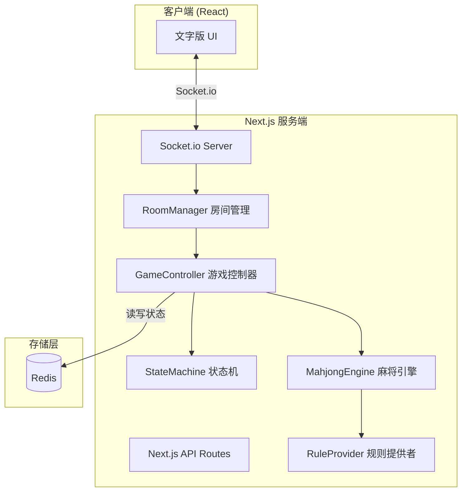
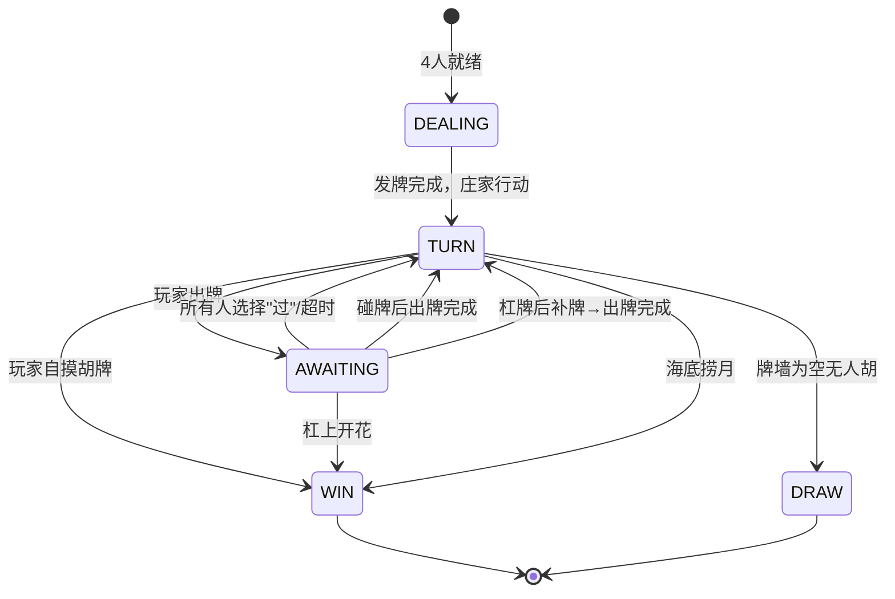

# 技术设计文档：中国麻将在线游戏

## 概述

本设计文档描述一个基于 Web 的四人在线中国麻将游戏系统。系统以四川麻将为底色，使用完整 136 张牌，仅允许自摸胡牌，支持碰、杠操作。

核心设计目标：
- 游戏逻辑与网络层解耦，Mahjong_Engine 为纯函数式核心，便于测试和扩展
- 状态机驱动游戏流程，确保状态转换的正确性和可预测性
- Redis 持久化保障断线恢复和服务重启后的状态一致性
- 规则模块化设计，通过接口和配置实现规则可扩展

## 架构

### 整体架构



### 分层设计

系统分为五层：

1. **传输层**：Socket.io 负责客户端与服务端的实时双向通信，auth 握手传递 playerId/nickname
2. **认证层**：基于 localStorage 的轻量级持久化身份（Persistent_ID），无需登录注册
3. **控制层**：RoomManager 管理房间生命周期，GameController 协调游戏流程
4. **引擎层**：StateMachine 管理状态流转，MahjongEngine 执行纯游戏逻辑，RuleProvider 提供可插拔规则
5. **持久层**：Redis 存储游戏状态、操作日志、分值日志和房间信息

### 认证流程

```
客户端 localStorage → mj_player_id + mj_nickname
    ↓
Socket.io auth: { playerId, nickname }
    ↓
服务端 persistentId = handshake.auth.playerId
    ↓
nicknameMap: playerId → nickname（内存映射）
    ↓
房间/游戏中所有 player.id 都是持久 ID
    ↓
重连时 playerId 精确匹配 → 恢复原座位（无需 ID 替换）
```

### 状态机流转



## 组件与接口

### 1. Tile（牌）

```typescript
// 花色枚举
enum TileSuit {
  WAN = 'wan',     // 万
  TIAO = 'tiao',   // 条
  TONG = 'tong',   // 筒
  FENG = 'feng',   // 风牌
  ZI = 'zi',       // 字牌
}

// 牌定义
interface Tile {
  suit: TileSuit;
  value: number;   // 数牌 1-9，风牌 1-4(东南西北)，字牌 1-3(中白发)
  id: number;      // 0-135 唯一标识
}
```

### 2. RuleProvider（规则提供者接口）

```typescript
interface WinChecker {
  canWin(hand: Tile[], melds: Meld[]): boolean;
}

interface ScoreCalculator {
  calcGangScore(type: 'ming' | 'an' | 'bu', gangPlayer: string, targetPlayer: string | null): ScoreChange[];
  calcWinScore(winner: string, others: string[]): ScoreChange[];
}

interface RuleConfig {
  allowDianPao: boolean;       // 是否允许点炮胡（当前 false）
  requireQueMen: boolean;      // 是否要求缺门（当前 false）
  gangScore: number;           // 杠分（当前 5）
  winScore: number;            // 胡牌分（当前 5）
}

interface RuleProvider {
  config: RuleConfig;
  winChecker: WinChecker;
  scoreCalculator: ScoreCalculator;
}
```

### 3. MahjongEngine（麻将引擎）

```typescript
interface MahjongEngine {
  // 牌集与洗牌
  createTileSet(): Tile[];
  shuffle(tiles: Tile[], seed: number): Tile[];

  // 发牌
  deal(wall: Tile[]): { hands: Tile[][]; wall: Tile[]; dealerExtra: Tile };

  // 摸牌与出牌
  draw(wall: Tile[]): { tile: Tile; wall: Tile[] };
  discard(hand: Tile[], tileId: number): { hand: Tile[]; discarded: Tile };

  // 碰杠操作
  canPeng(hand: Tile[], discarded: Tile): boolean;
  executePeng(hand: Tile[], discarded: Tile): { hand: Tile[]; meld: Meld };

  canMingGang(hand: Tile[], discarded: Tile): boolean;
  executeMingGang(hand: Tile[], discarded: Tile): { hand: Tile[]; meld: Meld };

  canAnGang(hand: Tile[]): Tile | null;
  executeAnGang(hand: Tile[], tile: Tile): { hand: Tile[]; meld: Meld };

  canBuGang(hand: Tile[], melds: Meld[]): { tile: Tile; meldIndex: number } | null;
  executeBuGang(hand: Tile[], melds: Meld[], tile: Tile, meldIndex: number): { hand: Tile[]; melds: Meld[] };

  // 补牌（从牌墙末端取牌，当牌墙长度不足时降级取最后一张）
  drawSupplement(wall: Tile[], position: 'last' | 'second_last'): { tile: Tile; wall: Tile[] };

  // 胡牌校验（委托给 RuleProvider）
  canWin(hand: Tile[], melds: Meld[]): boolean;
}
```

### 4. StateMachine（状态机）

```typescript
type GamePhase = 'DEALING' | 'TURN' | 'AWAITING' | 'WIN' | 'DRAW';

interface GameState {
  phase: GamePhase;
  roomId: string;
  players: PlayerState[];
  wall: Tile[];
  currentPlayerIndex: number;
  dealerIndex: number;
  seed: number;
  lastDiscard: { tile: Tile; playerIndex: number } | null;
  turnCount: number;
  roundNumber: number;               // 当前局数（第几局）
  consecutiveGangCount: number;  // 当前回合连续杠次数，在下一位玩家回合开始或当前玩家出牌完成时重置为 0
  gangRecords: GangRecord[];     // 累计杠分记录，仅在胡牌时结算，流局时原子清零
  isPaused: boolean;             // 断线暂停状态
  actionLog: ActionLogEntry[];
  lastDrawnTileId: number | null;    // 最近摸到的牌 ID，用于客户端高亮动画
  dealerFirstDiscard: { suit: string; value: number } | null;  // 庄家首牌四家同出追踪
  dealerFirstMatchCount: number;     // 已跟出相同牌的非庄家玩家数
  timeoutAutoPlayerIds: string[];    // 超时托管的玩家 ID 列表
}

// 杠分记录（延迟结算）
interface GangRecord {
  type: 'ming' | 'an' | 'bu';
  gangPlayerIndex: number;       // 执行杠操作的玩家
  targetPlayerIndex?: number;    // 明杠/补杠的被杠玩家
}

interface PlayerState {
  id: string;
  hand: Tile[];
  melds: Meld[];
  discardPool: Tile[];
  score: number;
  isConnected: boolean;
  isReady: boolean;
}

interface Meld {
  type: 'peng' | 'ming_gang' | 'an_gang' | 'bu_gang';
  tiles: Tile[];
  fromPlayer?: string;  // 碰/明杠来源玩家
}

interface StateMachine {
  transition(state: GameState, action: GameAction): GameState;
  getValidActions(state: GameState): GameAction[];
}
```

### 5. GameController（游戏控制器）

```typescript
interface GameController {
  startGame(roomId: string): Promise<void>;
  handlePlayerAction(roomId: string, playerId: string, action: GameAction): Promise<void>;
  handleTimeout(roomId: string, playerId: string, phase: GamePhase): Promise<void>;
  handleDisconnect(roomId: string, playerId: string): Promise<void>;
  handleReconnect(roomId: string, playerId: string): Promise<GameState>;
}
```

### 6. RoomManager（房间管理）

```typescript
interface RoomManager {
  createRoom(playerId: string): Promise<string>;
  joinRoom(roomId: string, playerId: string): Promise<void>;
  leaveRoom(roomId: string, playerId: string): Promise<void>;
  setReady(roomId: string, playerId: string): Promise<void>;
  initiateVoteDissolve(roomId: string, playerId: string): Promise<void>;
  voteDissolve(roomId: string, playerId: string, agree: boolean): Promise<void>;
}
```

### 7. 牌桌同心圆布局

牌桌中心区域（G-center）设计为三层同心圆结构，从外到内依次为：

1. **中间层（Meld 碰杠区）**：`G-meld-layer`，`position:absolute; inset:0`，grid 内容通过 `clamp()` padding 推至外缘。上家/下家/对家/自碰杠牌分别置于 grid 的 top/left/right/self 区域。
2. **内层（River 弃牌区）**：`G-river-layer`，`position:absolute; inset:clamp(3rem,6vh,5rem) clamp(1.5rem,4vw,3.5rem)`，grid 内容自动定位在更靠近圆心的内圈。
3. **圆心（Compass 方位块）**：`G-compass`，`position:relative; z-index:1`，使用 `::before` 伪元素绘制金色半透明圆形边框及径向渐变背景。

各层通过 `pointer-events:none` 确保点击穿透到手牌交互区。三层不重叠，形成视觉上的同心圆递进。

### 8. Socket 事件协议

```typescript
// 客户端 → 服务端
interface ClientEvents {
  'room:create': () => void;
  'room:join': (roomId: string) => void;
  'room:ready': () => void;
  'room:unready': () => void;
  'room:change-nickname': (nickname: string) => void;
  'room:kick': (targetId: string) => void;
  'room:dissolve': () => void;
  'room:start': () => void;
  'game:discard': (tileId: number) => void;
  'game:peng': () => void;
  'game:gang': (type: 'ming' | 'an' | 'bu', tileId?: number) => void;
  'game:hu': () => void;
  'game:pass': () => void;
  'room:vote-dissolve': () => void;
  'room:vote-dissolve-reply': (agree: boolean) => void;
}

// 服务端 → 客户端
interface ServerEvents {
  'room:created': (roomId: string) => void;
  'room:joined': (playerInfo: PlayerInfo) => void;
  'room:player-ready': (playerId: string) => void;
  'room:sync': (data: RoomSyncData) => void;
  'room:error': (message: string) => void;
  'room:vote-dissolve-request': (initiator: string) => void;
  'room:vote-dissolve-rejected': () => void;
  'room:dissolved': (scoreHistory?: ScoreHistory[]) => void;
  'game:dice-result': (data: DiceResultData) => void;
  'game:started': (initialState: ClientGameState) => void;
  'game:state-update': (state: ClientGameState) => void;
  'game:paused': (disconnectedPlayer: string) => void;
  'game:resumed': () => void;
}
```

### 8. RedisStore（持久化层）

```typescript
interface RedisStore {
  saveGameState(roomId: string, state: GameState): Promise<void>;
  getGameState(roomId: string): Promise<GameState | null>;
  deleteGameState(roomId: string): Promise<void>;
  saveActionLog(roomId: string, seed: number, log: ActionLogEntry[]): Promise<void>;
  getActionLog(roomId: string): Promise<{ seed: number; log: ActionLogEntry[] } | null>;
  saveRoom(roomId: string, room: RoomInfo): Promise<void>;
  getRoom(roomId: string): Promise<RoomInfo | null>;
  getAllActiveRooms(): Promise<string[]>;
}
```

## 数据模型

### Redis 数据结构

| Key 模式 | 类型 | 说明 | TTL |
|---|---|---|---|
| `room:{roomId}` | Hash | 房间基本信息（玩家列表、状态） | 无 |
| `game:{roomId}` | String (JSON) | 完整游戏状态（GameState 序列化） | 无 |
| `log:{roomId}:{timestamp}` | String (JSON) | 游戏日志（seed + 操作序列） | 7天 |
| `score:{roomId}` | List (JSON) | 分值日志（每局分数变动记录，按房间分类） | 7天 |
| `rooms:active` | Set | 活跃房间 ID 集合 | 无 |

### GameState 序列化格式

```json
{
  "phase": "TURN",
  "roomId": "abc123",
  "players": [
    {
      "id": "player1",
      "hand": [{"suit": "wan", "value": 1, "id": 0}, ...],
      "melds": [],
      "discardPool": [],
      "score": 0,
      "isConnected": true,
      "isReady": true
    }
  ],
  "wall": [...],
  "currentPlayerIndex": 0,
  "dealerIndex": 0,
  "seed": 12345,
  "lastDiscard": null,
  "turnCount": 1,
  "consecutiveGangCount": 0,
  "gangRecords": [],
  "isPaused": false,
  "actionLog": []
}
```

### ActionLogEntry 格式

```typescript
interface ActionLogEntry {
  timestamp: number;
  playerIndex: number;
  action: 'draw' | 'discard' | 'peng' | 'ming_gang' | 'an_gang' | 'bu_gang' | 'hu' | 'pass';
  tileId?: number;
  detail?: string;
}
```


## 正确性属性

*属性（Property）是在系统所有有效执行中都应成立的特征或行为——本质上是对系统应做什么的形式化陈述。属性是人类可读规格说明与机器可验证正确性保证之间的桥梁。*

### Property 1: 牌集不变量

*For any* 调用 createTileSet() 生成的牌集，总数应恰好为 136 张，其中条/筒/万各 36 张（1-9 各 4 张），风牌 16 张（东南西北各 4 张），字牌 12 张（中白发各 4 张），且每张牌的 id 在 0-135 范围内唯一。

**Validates: Requirements 3.1**

### Property 2: 确定性洗牌

*For any* 有效的 seed 值和牌集，使用相同 seed 对相同牌集执行两次洗牌，应产生完全相同的牌序结果。

**Validates: Requirements 3.2, 3.3**

### Property 3: 发牌不变量

*For any* 有效的 136 张牌墙，发牌完成后每位非庄家玩家应持有 13 张手牌，庄家应持有 14 张手牌，牌墙剩余牌数应为 136 - 13×4 - 1 = 83 张，且所有手牌与牌墙中的牌合集应等于原始牌墙。

**Validates: Requirements 4.2**

### Property 4: 状态机转换正确性

*For any* 有效的 GameState，状态机转换应满足以下规则：DEALING 完成后进入 TURN 且当前玩家为庄家；TURN 阶段出牌后进入 AWAITING；AWAITING 阶段所有人选择"过"后进入下一位玩家的 TURN；满足自摸条件时进入 WIN；牌墙为空且无人胡牌时进入 DRAW。

**Validates: Requirements 4.3, 4.4, 4.5, 4.6, 4.7**

### Property 5: 摸牌不变量

*For any* 非空牌墙，执行 draw 操作应返回牌墙首端的牌，且操作后牌墙长度减少 1，剩余牌墙为原牌墙去掉首张牌后的子序列。

**Validates: Requirements 5.1**

### Property 6: 出牌不变量

*For any* 有效手牌和手牌中存在的牌 ID，执行 discard 操作后，手牌数量减少 1，被打出的牌应加入该玩家的弃牌池，且手牌中不再包含该牌。

**Validates: Requirements 5.3**

### Property 7: 碰杠条件判断正确性

*For any* 随机生成的手牌和弃牌，canPeng 返回 true 当且仅当手牌中存在至少 2 张与弃牌花色和数值相同的牌；canMingGang 返回 true 当且仅当手牌中存在至少 3 张与弃牌相同的牌；canAnGang 返回非 null 当且仅当手牌中存在 4 张相同的牌；canBuGang 返回非 null 当且仅当已碰的 meld 中存在与手牌中某张牌相同的组合。

**Validates: Requirements 6.1, 7.1, 7.2, 7.3**

### Property 8: 碰牌执行不变量

*For any* 满足碰牌条件的手牌和弃牌，执行 executePeng 后，手牌数量减少 2，产生的 meld 包含 3 张花色和数值相同的牌，且手牌 + meld 中的牌 + 弃牌池 = 操作前的手牌 + 弃牌。

**Validates: Requirements 6.2**

### Property 9: 补牌位置正确性与越界保护

*For any* 非空牌墙，补牌规则应满足：首次明杠取倒数第 2 张；首次暗杠或补杠取倒数第 1 张；当前回合连续杠（非首次）取倒数第 1 张。且补牌后牌墙长度减少 1。当牌墙剩余张数小于补牌所需的索引位置时（例如明杠要求倒数第 2 张但牌墙仅剩 1 张），drawSupplement 必须强制降级取牌墙最后一张牌，严禁抛出数组越界异常。特别地，当牌墙仅剩 1 张时触发明杠补牌，必须断言返回值为该唯一剩余牌而非 undefined。

**Validates: Requirements 7.4, 7.5, 7.6**

### Property 10: 胡牌校验正确性

*For any* 由 7 个对子（每组 2 张相同牌）组成的 14 张手牌，canWin 应返回 true（七对子）。*For any* 满足标准胡牌牌型（N 组面子 + 1 组雀头，其中面子为顺子或刻子）的手牌，canWin 应返回 true。*For any* 不满足任何合法牌型的手牌，canWin 应返回 false。

**Validates: Requirements 8.1, 8.2, 8.5**

### Property 11: 杠分计算正确性

*For any* 杠操作，明杠和补杠应记录被杠玩家欠执行者 5 分；暗杠应记录其他三位玩家各欠执行者 5 分（共 15 分）。杠分记录的总和应始终为零（零和）。

**Validates: Requirements 9.1, 9.2, 9.3**

### Property 12: 胡牌结算正确性

*For any* 包含累计杠分记录的游戏状态，当某玩家自摸胡牌时，最终分数变动应等于：累计杠分 + 胡牌分（其他三位各扣 5 分，胡牌者得 15 分），且所有玩家分数变动总和为零。

**Validates: Requirements 9.4**

### Property 13: 流局杠分原子清零

*For any* 包含累计杠分记录的游戏状态，当牌墙为空且当前玩家结束操作后，状态机进入 DRAW 阶段。在 transition 函数进入 DRAW 的瞬间，所有杠分记录（gangRecords）必须被原子化清零，不得写入持久化的 players.score 中，所有玩家的 Score 不发生任何变动。属性测试应通过模拟 Redis 持久化层验证：DRAW 转换完成后写入 Redis 的 GameState 快照中 gangRecords 为空数组，且 players.score 与转换前一致。

**Validates: Requirements 9.5**

### Property 14: 座位分配正确性

*For any* 1 到 4 名玩家按顺序加入房间，第 1 位分配东、第 2 位分配南、第 3 位分配西、第 4 位分配北，且座位分配不受玩家 ID 影响，仅取决于加入顺序。

**Validates: Requirements 10.4**

### Property 15: 掷骰子定庄

*For any* 4 名玩家的骰子点数组合，若存在唯一最大值，则该玩家应被选为庄家；若存在多个相同最大值，则应触发这些玩家重掷，直至决出唯一最大者。

**Validates: Requirements 10.6, 10.7**

### Property 16: 投票解散逻辑

*For any* 4 名玩家的投票组合（同意/不同意），当且仅当同意人数 >= 3 时游戏应被解散；否则游戏继续。

**Validates: Requirements 12.2, 12.3**

### Property 17: GameState 序列化 round-trip

*For any* 有效的 GameState 对象，将其序列化为 JSON 后再反序列化，应得到与原始对象完全等价的 GameState。

**Validates: Requirements 14.2**

### Property 18: 牌面格式化

*For any* 有效的 Tile 对象，格式化函数应返回包含该牌花色名称和数值的可读字符串（如"一万"、"东风"、"红中"），且不同的牌应产生不同的格式化结果。

**Validates: Requirements 15.2**

### Property 19: 操作日志完整性

*For any* 游戏操作序列，每个操作执行后日志条目数应增加 1，日志中的时间戳应严格递增，且每条日志应包含正确的 playerIndex、action 类型和相关参数。

**Validates: Requirements 2.2**

### Property 20: 规则配置生效

*For any* 有效的 RuleConfig 配置组合，MahjongEngine 的行为应与配置一致。例如当 allowDianPao=false 时，点炮胡牌检查应始终返回 false。

**Validates: Requirements 16.2**

### Property 21: Mock_Wall 牌序一致

*For any* 预设的牌墙序列（支持全量注入或仅注入尾部牌序），当 Mock_Wall 启用时，发牌和摸牌的顺序应严格按照预设序列进行，与正常洗牌流程产生的结果无关。仅注入尾部牌序时，未被覆盖的部分仍按 Seed 洗牌结果排列。

**Validates: Requirements 17.2**

### Property 22: 房间满员拒绝

*For any* 已有 4 名玩家的房间，任何新玩家的加入请求应被拒绝，房间玩家数量保持不变。

**Validates: Requirements 10.3**

## 错误处理

### 网络层错误

| 错误场景 | 处理策略 |
|---|---|
| Socket 连接断开 | 5 秒内检测，将玩家标记为断线状态，立即启用智能托管模式代替该玩家操作，通知其他玩家显示托管标识，持久化当前状态 |
| 断线期间 | 智能托管自动代打：TURN 阶段立即执行智能出牌（选择最孤立的牌），AWAITING 阶段立即自动选择"过"。不启动倒计时，不参与超时判断。游戏不暂停，持续进行 |
| 重连恢复 | 从 Redis 恢复完整状态，取消托管模式，玩家恢复手动操作。支持通过加入房间号补位断线玩家 |
| 消息发送失败 | Socket.io 内置重试机制，失败后记录日志 |
| 并发操作冲突 | 服务端以 GameState 为单一事实源，拒绝无效操作并返回当前状态 |

### 游戏逻辑错误

| 错误场景 | 处理策略 |
|---|---|
| 非法操作（如非当前玩家出牌） | 拒绝操作，返回错误码和当前有效操作列表 |
| 无效牌 ID | 校验牌 ID 是否在手牌中，不存在则拒绝并返回错误 |
| 状态机非法转换 | 记录错误日志，拒绝操作，保持当前状态不变 |
| 胡牌校验异常 | 捕获异常，记录手牌快照，返回校验失败 |

### 持久化层错误

| 错误场景 | 处理策略 |
|---|---|
| Redis 连接失败 | 重试 3 次（指数退避），失败后暂停游戏并通知玩家 |
| Redis 写入失败 | 重试写入，失败后将状态缓存在内存中，恢复后同步 |
| 数据反序列化失败 | 记录错误日志和原始数据，尝试从操作日志重建状态 |
| Redis 数据过期/丢失 | 通过 Seed + 操作日志重放恢复游戏状态 |

### 超时处理

| 错误场景 | 处理策略 |
|---|---|
| TURN 阶段 30 秒超时 | 先检查是否能胡牌（能胡则自动胡），否则自动摸牌并通过智能出牌算法选择最孤立的牌打出。超时后标记为托管状态，玩家手动操作后取消托管，下次回合重新给 30 秒 |
| AWAITING 阶段 15 秒超时 | 自动选择"过"操作 |
| 投票解散 30 秒超时 | 未投票玩家视为不同意 |

## 测试策略

### 属性测试（Property-Based Testing）

使用 `fast-check` 库（TypeScript 生态中成熟的 PBT 库）进行属性测试。

配置要求：
- 每个属性测试最少运行 100 次迭代
- 每个测试用注释标注对应的设计文档属性
- 标注格式：`Feature: chinese-mahjong-online, Property {number}: {property_text}`

重点覆盖的属性测试：
- Property 1-3：牌集生成、洗牌确定性、发牌不变量
- Property 4：状态机转换正确性
- Property 5-6：摸牌/出牌基本操作不变量
- Property 7-9：碰杠操作条件判断、执行不变量、补牌位置与越界保护
- Property 10：胡牌校验（标准牌型 + 七对子）
- Property 11-13：杠分计算、胡牌结算、流局杠分原子清零
- Property 14-16：座位分配、掷骰子定庄、投票解散
- Property 17：GameState 序列化 round-trip
- Property 18-22：牌面格式化、日志完整性、规则配置、Mock_Wall（含部分注入）、房间满员

### 单元测试（Example-Based）

使用 `vitest` 作为测试框架，重点覆盖：
- 特定胡牌牌型示例（清一色、对对胡、七对子等具体牌面）
- 杠上开花、海底捞月等特殊场景
- 超时自动操作的具体行为
- 庄家继承规则（胡牌者当庄、流局庄不变）
- 边界条件：空牌墙摸牌、手牌为空时出牌等

### 集成测试

使用 `vitest` + `socket.io-client` 进行集成测试：
- Socket.io 连接/断线/重连流程
- Redis 状态持久化与恢复
- 房间创建/加入/就绪完整流程
- 完整游戏流程端到端测试（使用 Mock_Wall）
- Docker 容器启动与服务健康检查

### 测试环境

- 使用 Mock_Wall 接口注入预设牌墙，确保测试场景可复现
- 使用 `ioredis-mock` 或 Docker 中的 Redis 实例进行持久化测试
- 属性测试中使用 `fast-check` 的 `fc.gen()` 生成随机牌面、手牌、游戏状态
